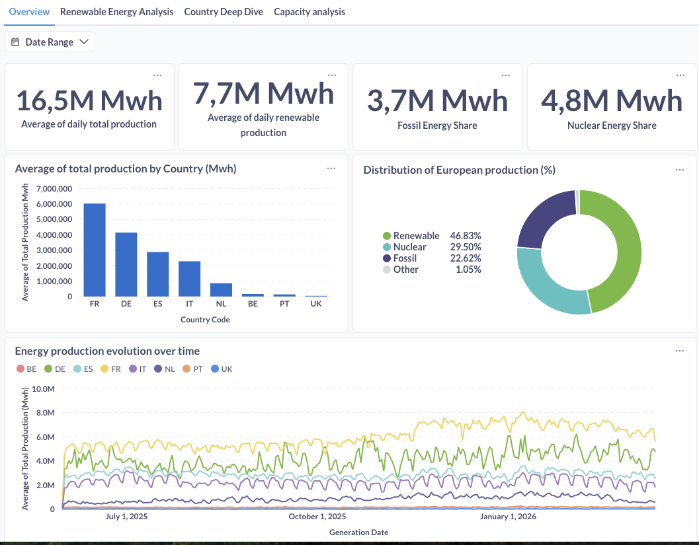
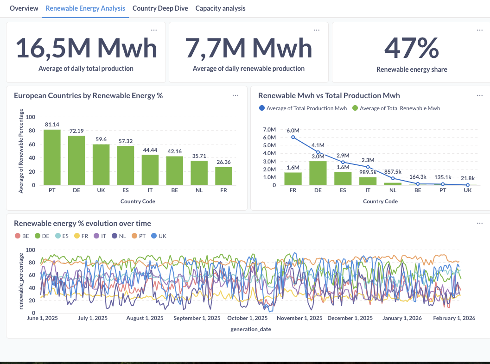
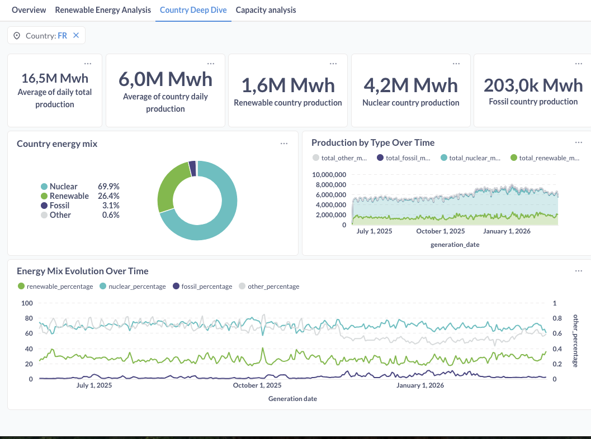
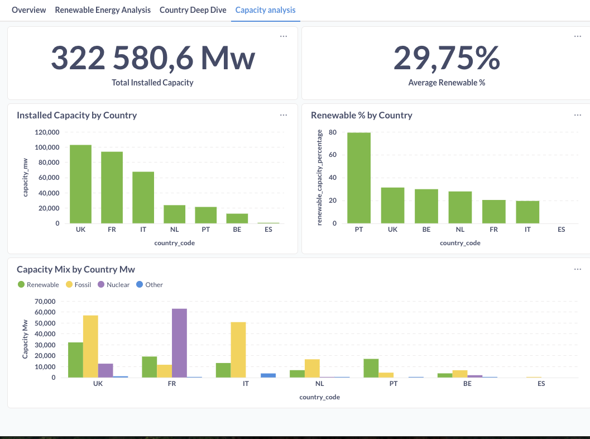

# European Energy Transition Analysis

## 📖 Description

This project analyzes the European energy transition, exploring how countries have evolved their electricity mix toward renewable sources. It covers **8 European countries** with **9 months of historical data** (June 2025 - March 2026), representing nearly **200,000 data points**.

## 🎯 Objectives

This project answers key questions about Europe's energy transition:

- **Energy Mix Evolution**: How has the share of renewable vs. fossil fuels changed across European countries?
- **Transition Leaders**: Which countries are leading the renewable energy adoption?
- **Production Patterns**: What are the daily and seasonal patterns in electricity generation?
- **Country Comparison**: How do different countries compare in their energy transition progress?

## 🛠️ Tech Stack

| Layer | Technology |
|-------|------------|
| **Data Ingestion** | Python custom scripts (ENTSO-E API) |
| **Data Warehouse** | Google BigQuery (GCP) |
| **Data Transformation** | dbt (data build tool) |
| **Data Visualization** | Metabase |
| **CI/CD** | GitHub Actions |
| **Version Control** | Git & GitHub |
| **Containerization** | Docker *(planned)* |

## 🏗️ Architecture

```
┌─────────────────┐     ┌─────────────────┐     ┌─────────────────┐
│   ENTSO-E API   │────▶│  Python Script  │────▶│    BigQuery     │
│  (Data Source)  │     │   (Ingestion)   │     │    (Bronze)     │
└─────────────────┘     └─────────────────┘     └────────┬────────┘
                                                         │
                        ┌────────────────────────────────┘
                        ▼
              ┌─────────────────┐     ┌─────────────────┐
              │       dbt       │────▶│    BigQuery     │
              │ (Transform)     │     │  (Silver/Gold)  │
              └─────────────────┘     └────────┬────────┘
                                               │
                        ┌──────────────────────┘
                        ▼
              ┌─────────────────┐
              │    Metabase     │
              │  (Dashboards)   │
              └─────────────────┘
```

### Medallion Architecture

| Layer | Dataset | Description |
|-------|---------|-------------|
| **Bronze** | `analytics_bronze` | Raw data from ENTSO-E API |
| **Silver** | `analytics_silver` | Cleaned & standardized (staging + intermediate) |
| **Gold** | `analytics_gold` | Business-ready aggregations (marts) |

## 📊 Current State

### Data Coverage
- **Countries**: 🇫🇷 France, 🇩🇪 Germany, 🇪🇸 Spain, 🇮🇹 Italy, 🇳🇱 Netherlands, 🇵🇹 Portugal, 🇧🇪 Belgium, 🇬🇧 UK
- **Period**: June 2025 - March 2026 (9 months)
- **Data Points**: ~198,000 rows
- **Granularity**: Hourly generation data

### Document Types Ingested
| Code | Description | Status |
|------|-------------|--------|
| A75 | Actual Generation per Type | ✅ All countries |
| A73 | Generation Forecast | ✅ Available countries |
| A68 | Installed Capacity | ✅ All countries |

### dbt Models
- **Staging**: 3 views (stg_entsoe__generation, stg_entsoe__capacity, stg_entsoe__forecast)
- **Intermediate**: 1 view (int_generation_daily)
- **Marts**: 3 tables (dim_countries, fct_energy_mix, fct_renewable_capacity)
- **Tests**: 14 data quality tests (100% passing)

### Dashboards
Metabase dashboards available with:
- Energy mix by country (renewable vs fossil vs nuclear)
- Renewable percentage trends over time
- Country comparison rankings
- Installed capacity analysis

## 📊 Dashboard Screenshots

<details>
<summary>📈 Click to view dashboard screenshots</summary>

### Tab 1: Overview
EU-level energy production metrics with renewable/fossil/nuclear breakdown.



### Tab 2: Renewable Energy Analysis
Deep dive into renewable energy sources across countries.



### Tab 3: Country Deep Dive
Interactive country-specific analysis with dynamic filtering.



### Tab 4: Capacity Analysis
Installed capacity analysis by country and energy type.



</details>

## 🚀 Getting Started

### Prerequisites
- Python 3.9+
- Google Cloud Platform account with BigQuery enabled
- ENTSO-E API key ([register here](https://transparency.entsoe.eu/))

### 1. Clone the repository
```bash
git clone https://github.com/davidedeoliveirabugalho-hub/eu_energy_transition_analysis.git
cd eu_energy_transition_analysis
```

### 2. Set up environment
```bash
# Create virtual environment
python -m venv venv
source venv/bin/activate  # On Windows: venv\Scripts\activate

# Install dependencies
pip install -r requirements.txt
```

### 3. Configure credentials
```bash
# Copy environment template
cp .env.example .env

# Edit .env with your credentials:
# - ENTSOE_API_KEY: Your ENTSO-E API key
# - GCP_PROJECT_ID: Your Google Cloud project ID
# - BIGQUERY_DATASET: Keep as 'analytics_bronze'
# - GOOGLE_APPLICATION_CREDENTIALS: Path to your GCP service account key
```

### 4. Create BigQuery datasets
```bash
# Using Google Cloud SDK
bq mk --dataset --location=EU your-project-id:analytics_bronze
bq mk --dataset --location=EU your-project-id:analytics_silver
bq mk --dataset --location=EU your-project-id:analytics_gold
```

### 5. Run data ingestion
```bash
# Incremental mode (recommended for daily runs)
# Automatically detects last ingested date per country
python scripts/ingest_entsoe_data.py

# Full backfill from specific date
python scripts/ingest_entsoe_data.py --start 2025-06-01 --end 2026-03-13

# Prevent Mac sleep during long ingestion
caffeinate -i python scripts/ingest_entsoe_data.py
```

### 6. Run dbt transformations
```bash
cd dbt
dbt run
dbt test
```

## 🔄 CI/CD Pipeline

GitHub Actions automatically runs on every push to `main`:
- ✅ dbt compile
- ✅ dbt test (14 data quality tests)

Badge: Check the Actions tab for pipeline status.

## 📚 Data Sources

### Currently Used
- **[ENTSO-E Transparency Platform](https://transparency.entsoe.eu/)** - European electricity generation data by source (A75, A73, A68 documents)

### Roadmap (Future Integration)
- **[ERA5 (Copernicus)](https://cds.climate.copernicus.eu/)** - Weather data for renewable correlation analysis
- **[EPEX Spot](https://www.epexspot.com/)** - Energy market prices
- **Consumption data** - A65 document type from ENTSO-E

## 🗺️ Roadmap

### Completed ✅
- [x] Python ingestion scripts with incremental mode
- [x] BigQuery medallion architecture (bronze/silver/gold)
- [x] dbt models with staging, intermediate, and marts layers
- [x] 14 data quality tests
- [x] Metabase dashboards
- [x] GitHub Actions CI/CD
- [x] 9 months of historical data (8 countries)

### In Progress 🔄
- [ ] Dashboard refinements (time series readability)
- [ ] README and documentation updates

### Planned 📋
- [ ] Docker containerization for easy deployment
- [ ] Add consumption data (A65 document type)
- [ ] Weather data correlation (ERA5)
- [ ] Energy price analysis (EPEX)
- [ ] Expand to more EU countries

## 📝 Project Status

🟢 **90% Complete** - Core pipeline operational with CI/CD, ready for portfolio presentation.

## 🏗️ Technical Decisions

For detailed technical decisions and alternatives explored, see [docs/technical_decisions.md](docs/technical_decisions.md)

## 👤 Author

**David Bugalho**
- Career changer: 15 years operational management → Data Analytics
- Certifications: DataBird Data Analyst & Analytics Engineer
- LinkedIn: [Connect with me](https://www.linkedin.com/in/david-de-oliveira-bugalho/)

## 📄 License

This project is for portfolio and educational purposes.